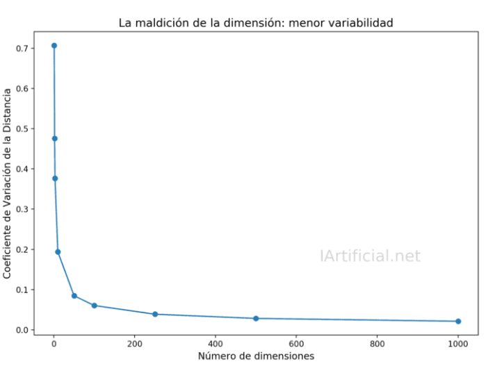

# Proyecto 3 de Base de datos 2.

## **Integrantes**
* Chahua, Luis
* Aguilar, Anthony
* Rubio, Ignacio
* Ángeles, Jean

# Implementación

# Backend
## Librerías utilizadas
Para este proyecto se utilizó principalmente la librería de Face Recognition. Esto nos facilitó en poder representar a las imágenes mediante vectores numéricos. Además, es la base para poder determinar el grado de similitud entre dos imágenes. Cabe resaltar que este vector tiene dimensión de tamaño 128 y será utilizado en los 3 algoritmos de este proyecto. Asimismo, se utilizaron librerías complementarias como el Rtree, que, junto con la indexación, nose permitirá obtener las k imágenes más parecidas de forma eficiente usando KNN-RTree. Por último, se usó la librería de sklearn para trabajar con el KDTree de manera eficiente.

## Análisis de la maldición de la dimensionalidad
Debido a que el tamaño de los vectores son de 128, es muy probable que, al momento de calcular las distancias entre imágenes, se pueda apreciar que hay muy poca variabilidad entre ellas, lo cual no es nada favorable si se quiere justamente analizar diferencias. Es por ello que es necesario hacer una reducción de la dimensionalidad.

Se puede apreciar en este gráfico que a mayor tamaño de la dimensionalidad, hay menor variabilidad en las distancias. Asimismo, también influye mucho la cantidad de información que se puede almacenar en una estructura. Por ejemplo, para el KDTree, como cada vector se almacena en un árbol, cada nodo tendrá que almacenar una grán cantidad de datos, lo cual puede afecta en la cantidad de memoria y en el costo de las búsquedas.
Para mitigar esto, se utilizó el módulo PCA proporcionado por la librería de SKLearn. Esto te permite reducir la dimensionalidad de la imagen. Para este caso, se redució hasta 50, note que no puede ser tan pequeño porque se puede perder información importante de las imágenes.
