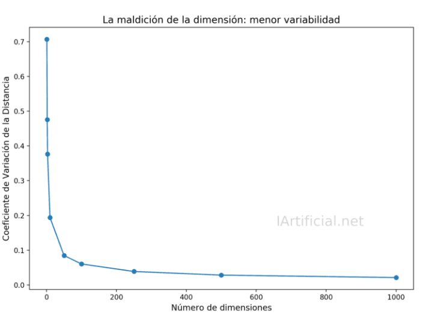
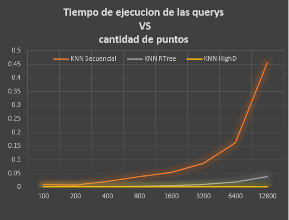
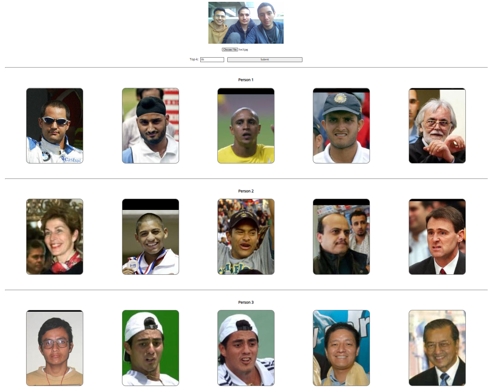

# Proyecto 3 de Base de datos 2.

## **Integrantes**
* Chahua, Luis
* Aguilar, Anthony
* Rubio, Ignacio
* Ángeles, Jean

# Implementación

# Backend
## Librerías utilizadas
Para este proyecto se utilizó principalmente la librería de Face Recognition. Esto nos facilitó en poder representar a las imágenes mediante vectores numéricos. Además, es la base para poder determinar el grado de similitud entre dos imágenes. Cabe resaltar que este vector tiene dimensión de tamaño 128 y será utilizado en los 3 algoritmos de este proyecto. Asimismo, se utilizaron librerías complementarias como el Rtree, que, junto con la indexación, nose permitirá obtener las k imágenes más parecidas de forma eficiente usando KNN-RTree. Por último, se usó la librería de sklearn para trabajar con el KDTree de manera eficiente.

## Algoritmos
### Indexación
Para la indexacion de las imagenes primero las analaizamos con la libreria de "face_recognition" para obtener los vectores caracteristicos. Luego usamos la libreria "rtree" para indexar estos vecotres en un indice rtree en disco. Esto se hace insertando cada vector caracteristico en la estructura de datos.
### Búsqueda KNN
Para la busqueda KNN la libreria nos proporciona con una funcion "nearest" la cual aplica el algoritmo visto en clase para encontrar los N vecinos mas cercanos.

### Búsqueda por rango
No damos soporte para este tipo de busqueda en nuestra demo.
## Análisis de la maldición de la dimensionalidad
Debido a que el tamaño de los vectores son de 128, es muy probable que, al momento de calcular las distancias entre imágenes, se pueda apreciar que hay muy poca variabilidad entre ellas, lo cual no es nada favorable si se quiere justamente analizar diferencias. Es por ello que es necesario hacer una reducción de la dimensionalidad.

Se puede apreciar en este gráfico que a mayor tamaño de la dimensionalidad, hay menor variabilidad en las distancias. Asimismo, también influye mucho la cantidad de información que se puede almacenar en una estructura. Por ejemplo, para el KDTree, como cada vector se almacena en un árbol, cada nodo tendrá que almacenar una grán cantidad de datos, lo cual puede afecta en la cantidad de memoria y en el costo de las búsquedas.
Para mitigar esto, se utilizó el módulo PCA proporcionado por la librería de SKLearn. Esto te permite reducir la dimensionalidad de la imagen. Para este caso, se redució hasta 50, note que no puede ser tan pequeño porque se puede perder información importante de las imágenes. 

## Experimentación 

La experimentación se realizó variando los tamaños de N y fijando el valor de k=8. Además, calcularemos los tiempos en cada algoritmo mediante la función experimentacion definida en el código(para KDTree, KNN_Sequential) y se ejecutar á la función de KRtree para calcular su tiempo. Primero, de forma teórica, se sabe que para el KNNSecuencial, la complejidad es de O(N*D + N*logk) donde D representa a la complejidad del cálculo de la distancia entre 2 imágenes. Los resultados han sido los siguientes:

<table>
    <thead>
        <tr>
            <th >N (& k=8)</th>
            <th>KNN Secuencial</th>
            <th>KNN RTree</th>
            <th>KNN HighD</th>
        </tr>
    </thead>
    <tbody>
        <tr>
            <td>100</td>
            <td>0.008595</td>
            <td>0.000266</td>
            <td>0.000100</td>
        </tr>
        <tr>
            <td>200</td>
            <td>0.006921</td>
            <td>0.000422</td>
            <td>0.000100</td>
        </tr>
        <tr>
            <td >400</td>
            <td>0.020270</td>
            <td>0.000743</td>
            <td>0.000200</td>
        </tr>
        <tr>
            <td>800</td>
            <td>0.020270</td>
            <td>0.001822</td>
            <td>0.000300</td>
        </tr>
        <tr>
            <td>1600</td>
            <td>0.052544</td>
            <td>0.003947</td>
            <td>0.000500</td>
        </tr>
        <tr>
            <td>3200</td>
            <td>0.086557</td>
            <td>0.008111</td>
            <td>0.000900</td>
        </tr>
        <tr>
            <td>6400</td>
            <td>0.162084</td>
            <td>0.017595</td>
            <td>0.001000</td>
        </tr>
        <tr>
            <td>12800</td>
            <td>0.454654</td>
            <td>0.038934</td>
            <td>0.001400</td>
        </tr>
    </tbody>
</table>

En esta gráfica, se puede apreciar que, comparando tiempos de ejecución, se tiene que KDHighD < RTree < KNN_Sequential. Esto se debe a que el uso del índice y el uso de las estructuras de datos hacen más eficiente los algoritmos de búsqueda a comparación de hacerlo secuencialmente. 

# Frontend

## Librerías utilizadas
El front se implementó en JS utilizando principalmente el framework/librería ReactJS. Para la comunicación con la API se utilizó la librería axios. Para los estilos se utilizó CSS.

## Use Case
Primero el usuario le hace click al botón de subir archivo y este selecciona una imagen. La imagen se muestra en pantalla. Después, el usuario ingresa un valor en el input de topk, esto determinará cuantas imágenes se piden en el request por persona en la foto ingresada. Finalmente, el usuario le hace click al botón que dice submit, lo que causa que se haga un request a la API que retorna un arreglo de arreglos de todos, un arreglo por persona en la foto. Estas imágenes se muestran debajo de la imagen con la que se compararon.

